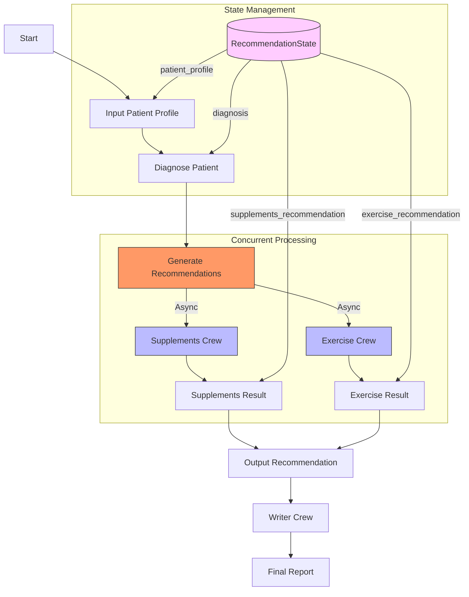

# MedAI Flow

A medical AI assistant that generates personalized health recommendations using CrewAI.

## Overview

MedAI Flow is an AI-powered system that:
1. Analyzes patient profiles
2. Provides medical diagnosis
3. Generates personalized supplement recommendations
4. Creates tailored exercise plans
5. Combines all insights into a comprehensive health report

## Project uses CrewAI

CrewAI is a framework for building multi-agent systems with ease. It's a powerful tool for building AI agents that can collaborate on complex tasks.


## Installation

Ensure you have Python >=3.10 <3.13 installed on your system. This project uses [UV](https://docs.astral.sh/uv/) for dependency management and package handling, offering a seamless setup and execution experience.

First, if you haven't already, install uv:

```bash
pip install uv
```

Next, navigate to your project directory and install the dependencies:

(Optional) Lock the dependencies and install them by using the CLI command:
```bash
crewai install
```


## Flow Architecture

The system follows a sequential flow with concurrent processing capabilities. Here's the detailed flow diagram:



### Flow Components:

1. **Input Patient Profile**
   - Reads patient data from markdown file
   - Initializes the state

2. **Diagnose Patient**
   - Uses DiagnoseCrew with BMI and BRI calculators
   - Generates medical diagnosis

3. **Generate Recommendations**
   - Concurrent execution of Supplements and Exercise crews
   - Uses asyncio.gather for parallel processing

4. **Output Processing**
   - Writer Crew combines all insights
   - Generates final comprehensive report

### State Management

The `RecommendationState` class maintains:
- Patient profile
- Medical diagnosis
- Supplement recommendations
- Exercise recommendations
- Final recommendation


### Customizing

**Add your `OPENAI_API_KEY` into the `.env` file**

- Modify `src/medai_flow/config/agents.yaml` to define your agents
- Modify `src/medai_flow/config/tasks.yaml` to define your tasks
- Modify `src/medai_flow/crew.py` to add your own logic, tools and specific args
- Modify `src/medai_flow/main.py` to add custom inputs for your agents and tasks

## Running the Project

To kickstart your crew of AI agents and begin task execution, run this from the root folder of your project:

```bash
crewai flow kickoff
```

```bash
python src/medai_flow/main.py : kickoff
```

This command initializes the medai_flow Crew, assembling the agents and assigning them tasks as defined in your configuration.

This example, unmodified, will run the create a `report.md` file with the output of a research on LLMs in the root folder.

## Understanding Your Crew

The medai_flow Crew is composed of multiple AI agents, each with unique roles, goals, and tools. These agents collaborate on a series of tasks, defined in `config/tasks.yaml`, leveraging their collective skills to achieve complex objectives. The `config/agents.yaml` file outlines the capabilities and configurations of each agent in your crew.

## Support

For support, questions, or feedback regarding the {{crew_name}} Crew or crewAI.

- Visit our [documentation](https://docs.crewai.com)
- Reach out to us through our [GitHub repository](https://github.com/joaomdmoura/crewai)
- [Join our Discord](https://discord.com/invite/X4JWnZnxPb)
- [Chat with our docs](https://chatg.pt/DWjSBZn)

Let's create wonders together with the power and simplicity of crewAI.


## Streamlit
To run the app, you'll need to install Streamlit:
```bash
pip install streamlit
```

Then run the app with:

```bash
streamlit run src/medai_flow/app.py
```

The app will:
Accept patient profiles through file upload or text input
Show real-time status updates of each agent's work
Display the final recommendation with markdown formatting
Offer a download option for the recommendation