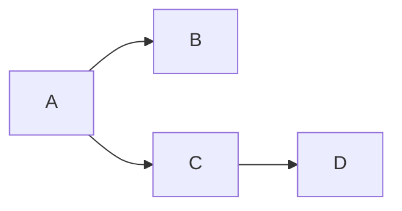

# MedAI Flow Ideas

## Flow Chart using mermaid

Just a template flow chart

## Quick Ideas
- [ ] would be vital to have a graphical represenation of all the logs and the conversations of the agents doing tasks that lead to the final output
- [ ] Idea 2

## Future Enhancements
### Priority High
- [ ] Enhancement 1
- [ ] Enhancement 2

### Priority Medium
- [ ] Enhancement 3
- [ ] Enhancement 4

## Notes & Brainstorming
### YYYY-MM-DD
- Quick thought about X
- Potential improvement for Y

## Research Topics
- [ ] Topic 1
  - Reference links
  - Key points